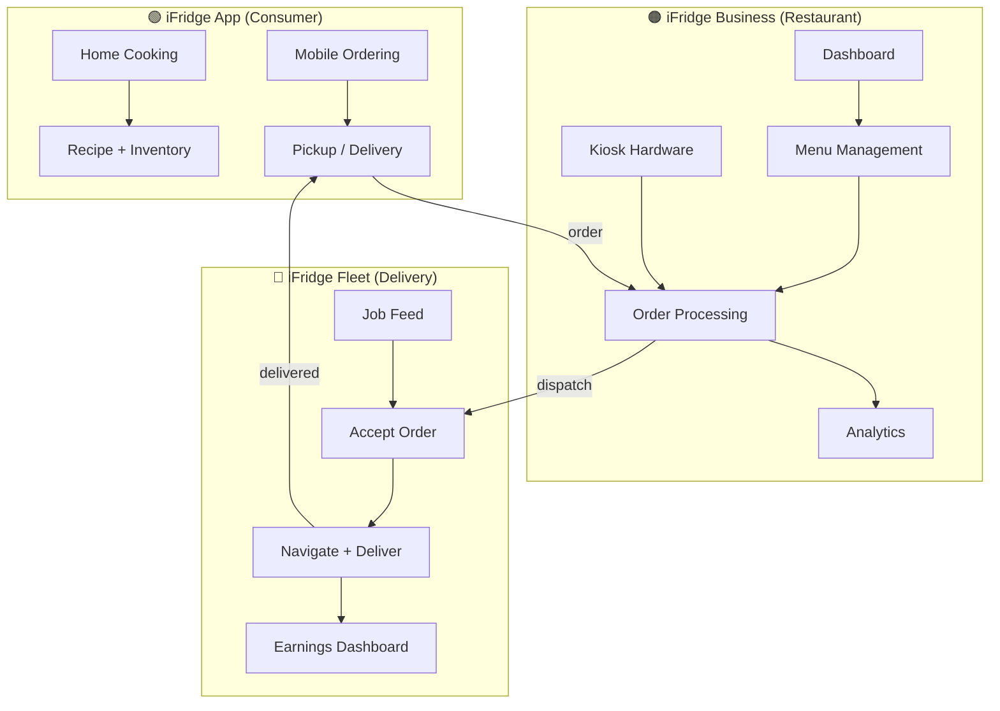
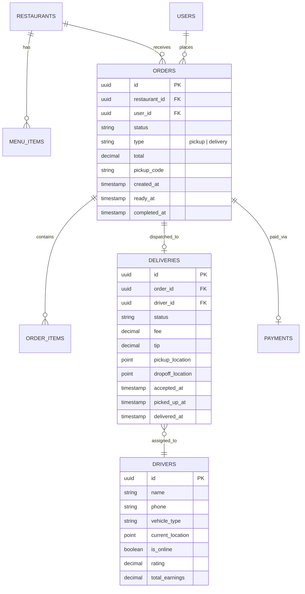

# iFridge Ecosystem — Business Strategy

## 🎯 Vision

Transform iFridge from a **personal kitchen app** into a **full food commerce ecosystem** with three interconnected platforms:



---

## 📦 Three Pillars

### Pillar 1 — Mobile Order & Pickup (Luckin Coffee Model)

> **Reference:** Luckin Coffee (China), Starbucks Mobile Order, Baemin (Korea)

**How it works:**
1. Consumer opens iFridge → switches to **Order mode**
2. Selects a nearby restaurant → browses menu
3. Places order + pays **in-app** (no cashier needed)
4. Gets a **pickup code / QR code**
5. Walks to the restaurant → picks up the order

**What the restaurant gets:**
- Real-time order feed on their **iFridge Business Dashboard**
- Push notifications for new orders
- Automatic receipt generation
- Zero cashier labor for mobile orders

**Revenue model:**
| Stream | Rate |
|--------|------|
| Per-transaction commission | 3–5% |
| Monthly SaaS subscription (dashboard) | $29–99/mo |
| Payment processing margin | 0.5–1% |

---

### Pillar 2 — Self-Service Kiosk Hardware (Korean Model)

> **Reference:** Kiosk machines at McDonald's Korea, 무인주문기, Baemin Kiosk

**What we sell:**
- **Touchscreen ordering kiosks** — customers order + pay at the machine
- **Kitchen display system (KDS)** — shows incoming orders in the kitchen
- **Receipt printers** — thermal printers for order confirmation

**How it integrates:**
- Kiosk runs a **web app** (iFridge Business Web) on an embedded tablet
- Same backend as the mobile app — orders flow to the same kitchen queue
- Restaurant manages ONE menu → serves kiosk, mobile app, and delivery

**Revenue model:**
| Stream | Rate |
|--------|------|
| Kiosk hardware sale | $500–1,500/unit |
| Monthly software license | $49–149/mo |
| Payment processing | 0.5–1% per transaction |
| Maintenance/support contract | $19/mo |

**Why restaurants want this:**
- No salesperson needed (labor savings)
- 24/7 ordering capability
- Faster throughput during rush hours
- Upselling via smart suggestions (AI-powered)
- Multilingual support (tourists)

---

### Pillar 3 — Shared Delivery Network (Fleet App)

> **Reference:** Uber Eats, Coupang Eats, DoorDash — but as a **shared fleet** any restaurant can tap into

**The problem we solve:**
- Small restaurants **can't afford** their own delivery drivers
- Existing platforms (Uber Eats, etc.) charge **30%+ commission**
- Delivery drivers want **more jobs** with less downtime

**How it works:**

````carousel
### 🍕 For Restaurants
1. Restaurant receives a delivery order (from iFridge app or kiosk)
2. Marks order as "Ready for pickup"
3. System broadcasts to nearby **iFridge Fleet** drivers
4. Driver accepts → picks up → delivers
5. Restaurant pays a flat fee per delivery ($2–5)

No need to hire, manage, or insure delivery staff.
<!-- slide -->
### 🚗 For Delivery Drivers
1. Driver opens **iFridge Fleet** app
2. Sees live job feed with nearby pickup locations
3. Accepts a job → navigates to restaurant → picks up
4. Delivers to customer → confirms delivery
5. Earns per-delivery + tips

More jobs available because ALL restaurants in the network share drivers.
<!-- slide -->
### 👤 For Consumers
1. Opens iFridge → Order mode → selects restaurant
2. Chooses **Delivery** (instead of Pickup)
3. Pays in-app (food + delivery fee)
4. Tracks driver in real-time on map
5. Receives food at door

Same seamless experience as Uber Eats, but at lower cost to the restaurant.
````

**Revenue model:**
| Stream | Rate |
|--------|------|
| Delivery commission (from restaurant) | $2–5 flat per order |
| Delivery fee (from consumer) | $1–3 |
| Surge pricing (peak hours) | +20–50% |
| Priority placement (restaurants) | $50–200/mo |

---

## 🏗️ Technical Architecture

### Apps to Build

| App | Platform | Users | Status |
|-----|----------|-------|--------|
| **iFridge** | iOS, Android, Web | Consumers | ✅ Exists (v4.0.0) |
| **iFridge Business** | Web + Tablet | Restaurant owners, staff | 🔲 New |
| **iFridge Fleet** | iOS, Android | Delivery drivers | 🔲 New |
| **iFridge Kiosk** | Web (embedded tablet) | Walk-in customers | 🔲 New |

### Backend Services to Add

```mermaid
graph LR
    subgraph Existing
        A[Auth Service]
        B[Inventory Service]
        C[Recipe AI Service]
        D[Restaurant Service]
    end

    subgraph New
        E[Order Service]
        F[Payment Service]
        G[Dispatch Service]
        H[Fleet Tracking Service]
        I[Notification Service]
        J[Menu Sync Service]
    end

    E --> F
    E --> G
    G --> H
    E --> I
    J --> E
```



| Service | Purpose |
|---------|---------|
| **Order Service** | Create, update, cancel orders. Status tracking. |
| **Payment Service** | Process payments (Stripe/local gateways). Refunds. |
| **Dispatch Service** | Match ready orders with nearby drivers. Optimal assignment. |
| **Fleet Tracking Service** | Real-time driver GPS. ETA calculation. |
| **Notification Service** | Push notifications to all three apps (Firebase). |
| **Menu Sync Service** | Single source of truth for menus → syncs to app, kiosk, web. |

### Database Schema Additions



---

## 📊 Competitive Advantage

| vs. Uber Eats / Coupang Eats | iFridge Ecosystem |
|-------------------------------|-------------------|
| 30%+ commission per order | 3–5% + flat delivery fee |
| Restaurant has NO customer data | Restaurant OWNS customer data |
| No inventory/kitchen integration | Full AI kitchen integration (iFridge core) |
| Delivery only | Pickup + Delivery + Kiosk |
| Generic platform | White-label feel — restaurant's brand first |

| vs. Toast / Square POS | iFridge Ecosystem |
|------------------------|-------------------|
| POS only, no consumer app | Full consumer app with 500K+ recipes |
| No delivery network | Built-in shared delivery fleet |
| No AI features | AI recipe suggestions based on inventory |
| Hardware lock-in | Open hardware (any Android tablet) |

---

## 🗺️ Rollout Roadmap

### Phase 1 — Foundation (Current → Q3 2026)
- [x] iFridge consumer app v4.0 (Cook + Order modes)
- [x] Restaurant discovery + menu viewing
- [ ] **In-app ordering** (pickup — no payment yet)
- [ ] **iFridge Business Web Dashboard** (order management)

### Phase 2 — Payments & Pickup (Q3–Q4 2026)
- [ ] Payment integration (Stripe / local gateways)
- [ ] Pickup code / QR code generation
- [ ] Real-time order status updates (WebSocket)
- [ ] Kitchen display system (KDS) web app

### Phase 3 — Kiosk Hardware (Q1 2027)
- [ ] iFridge Kiosk web app (full-screen tablet mode)
- [ ] Hardware sourcing (Android tablets + receipt printers)
- [ ] Pilot with 5–10 restaurants

### Phase 4 — Delivery Network (Q2–Q3 2027)
- [ ] **iFridge Fleet** driver app (Flutter)
- [ ] Dispatch algorithm (driver assignment)
- [ ] Real-time tracking (consumer ↔ driver)
- [ ] Driver onboarding + verification
- [ ] Pilot with 20+ restaurants, 50+ drivers

### Phase 5 — Scale (Q4 2027+)
- [ ] Multi-city expansion
- [ ] Franchise/white-label partnerships
- [ ] AI-powered demand forecasting for restaurants
- [ ] Loyalty program across ecosystem

---

## 💡 Key Insight

The genius of this model is the **flywheel effect:**

```
More restaurants → More menu choices → More consumers order
More consumers → More delivery jobs → More drivers join
More drivers → Faster delivery → Better consumer experience
Better experience → More orders → More revenue for restaurants
```

Each side of the marketplace reinforces the others. And the **iFridge consumer app** (which already exists) is the demand engine that powers everything.
